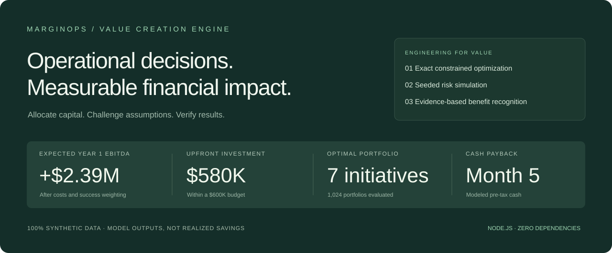
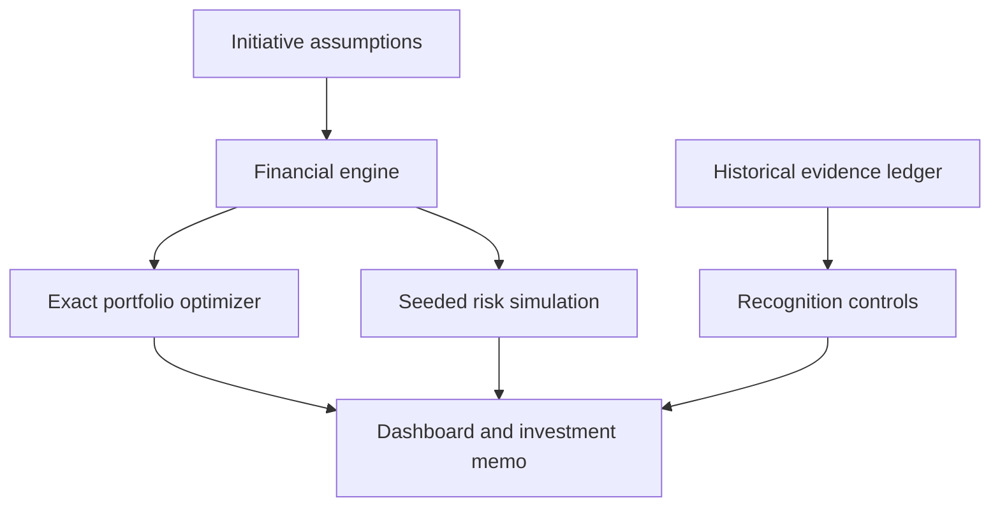

<div align="center">

# MarginOps
### Underwrite billions. Prove every dollar.

**Enterprise savings underwriting, EBITDA portfolio optimization, and value assurance—with a reproducible billion-dollar synthetic case.**

[](https://github.com/kingtutt52/marginops/actions/workflows/ci.yml)


</div>



Most improvement programs have a list of ideas. What they need is a defensible answer to **“Which initiatives should we fund, how much EBITDA could they create, and how will we prove it?”**

MarginOps closes that loop. It translates operating levers into monthly financial forecasts, finds the best feasible investment portfolio, stresses the assumptions, and reconciles claimed benefits to a finance-reviewed evidence ledger.

> **Portfolio demonstration.** Every company, initiative, evidence reference and financial figure is synthetic. The results below are model outputs, not actual savings or employer achievements. No credentials or proprietary data are required.

## Run in 30 seconds

Requires Node.js 22 or newer. There are **no external runtime dependencies, API keys, build steps or package installs**.

```bash
git clone https://github.com/kingtutt52/marginops.git
cd marginops
npm start
```

Open **http://localhost:3000**. Run `npm test` for the financial and API tests, or `npm run report` for a reproducible JSON analysis. The server binds to loopback by default; `HOST` and `PORT` are configurable.

## What the demonstration produces

The default global-enterprise case represents **1,000 comparable locations, $200B annual revenue, and $108B in distinct addressable expense pools**. Every baseline and improvement assumption is invented, not sourced from a real company or an industry benchmark.

| Model output | Synthetic enterprise base case |
|---|---:|
| **Net cost savings, Year 1** | **$5,026,627,833** |
| **Recurring expected net cost savings** | **$6,614,036,000 / year** |
| Expected incremental EBITDA, Year 1 | $5,082,894,500 |
| Total steady-state annual EBITDA impact | $6,785,236,000 |
| Upfront implementation expense + capex | $795,000,000 |
| First modeled cash recovery | Month 4 |
| Initiatives selected | 13 of 15 |
| Portfolios evaluated | 32,768 |
| Year 1 EBITDA P10 / P50 / P90 | $3.61B / $5.06B / $6.41B |

**The application models potential savings; it does not save or verify these amounts.** A $6.61B output depends on an exceptionally large expense base and substantial adopted expense reductions. Recurring values are annualized expectations after full ramp, not achieved results or calendar-year forecasts. The synthetic historical ledger remains $139K and is never scaled or added to projections.

Cost savings include the cost-program operating expenses, implementation expense in Year 1, and the enabling data foundation. Earned revenue contribution and receivables cash release are shown separately. The full reconciliation and assumption table are in [the billion-dollar worked case](docs/BILLION_DOLLAR_CASE.md).

The original mid-market case is still available through the profile selector: $2.39M expected Year 1 EBITDA at a $600K implementation budget. Use `npm run report -- --midmarket` to reproduce it.

## Explore the product

1. **Enterprise footprint** — switch between global-enterprise and mid-market profiles. Change location count; expense pools, program costs and delivery capacity scale together.
2. **Savings underwriting** — edit reduction rates, adoption coverage and expense conversion for every lever. Inspect unique spend exposure and alternatives.
3. **Portfolio overview** — adjust budget, delivery capacity, realization and rollout delay. Inspect an EBITDA bridge, monthly EBITDA versus cash, and simulation outcomes.
4. **Initiative workbench** — inspect economics and evidence requirements. Select a custom portfolio and see prerequisite, budget or overlap violations immediately.
5. **Benefits ledger** — distinguish observed change from attributable, finance-approved benefit. Pending and rejected claims receive no recognized credit.
6. **Model & methodology** — review formulas, accounting boundaries and limitations inside the application.
7. **Export investment memo** — download the current selection, financial case, uncertainty assumptions, evidence requirements and approval gates as Markdown. Export the full underwriting snapshot as JSON, including selected candidates, expanded assumptions, monthly results and risk outputs.

## Engineering that serves the business case

- **Bottom-up economics.** Annual gross cost input = distinct annual expense × improvement rate × adoption × expense conversion. Productivity without actual expense removal earns no cost savings.
- **One financial engine, two interfaces.** Pure ECMAScript modules execute in the browser, API and CLI, preventing frontend/backend formula drift.
- **Exact constrained selection.** Exhaustive subset optimization enforces budget, delivery capacity, prerequisite inclusion and mutually exclusive benefit pools. Empty selection is valid; negative projects are not forced into the portfolio.
- **Risk stays in the numbers.** Costs remain if initiatives fail. Expected forecasts weight benefits by probability; seeded simulation samples success events with a shared realization shock.
- **EBITDA is not cash.** Revenue uses contribution margin. Capex affects cash. Receivables acceleration produces a one-time cash release, not earnings.
- **Evidence before recognition.** The ledger rejects duplicate period/benefit-pool claims, preserves losses, and requires approval metadata for recognized benefits.
- **Simple deployment surface.** Node's built-in HTTP server, explicit static-file allowlist, bounded request bodies, restrictive content policy, no third-party runtime code.

There is **no LLM in the calculation path**. An AI integration can propose structured initiatives later; financial validation, optimization and approval should remain deterministic and inspectable.

## Architecture



```text
src/enterprise.mjs   Spend-pool underwriting, footprint scaling, savings bridge
src/engine.mjs       Forecasting, optimization, simulation, ledger validation
src/server.mjs       Local HTTP server and JSON API
src/report.mjs       Reproducible CLI analysis
web/                Responsive dashboard, scenario controls and memo export
data/               Enterprise and mid-market synthetic assumptions and historical ledger
test/               Financial invariants, independent oracle and HTTP tests
docs/               Financial methodology, API contract and model overview
```

## API

```bash
curl -X POST http://localhost:3000/api/optimize \
  -H 'Content-Type: application/json' \
  -d '{"profile":"enterprise","enterprise":{"sites":1000},"scenario":{"budget":900000000,"capacity":1600}}'
```

See [API contract](docs/API.md) for custom portfolio evaluation and error behavior. See [financial methodology](docs/METHODOLOGY.md) for equations, modeling choices and production boundaries.

## Verification

`npm test` passes **28 financial and API checks**, including savings-versus-revenue reconciliation, zero-adoption and zero-expense-conversion behavior, scale-consistent investment, unique spend-pool validation and enterprise API controls. The original suite covers capex treatment, contribution margin, working-capital classification, failure costs, rollout ramp, constraints, negative prerequisites, duplicate benefit claims, and simulation reproducibility. An independently expressed enumeration oracle verifies the synthetic portfolio optimum at multiple budgets. API checks cover malformed input, oversize bodies, route isolation and matching portfolio results.

The included GitHub Actions workflow runs syntax checks and the test suite on Node 22 and 24. A repeatable optional browser smoke script is included in `scripts/browser-smoke.mjs`. Browser verification has not been executed in the build environment because Chromium was unavailable and its download failed. The UI therefore still needs a real-browser visual review.

## Upgrade an existing checkout

Replace the repository files with the contents of the extracted `marginops` directory, then run `npm run check` and `npm test`. This version adds `data/enterprise.json`, `src/enterprise.mjs`, `test/enterprise.test.mjs` and `docs/BILLION_DOLLAR_CASE.md`. Keep folder paths intact.

The GitHub web uploader may skip configuration files whose names start with a dot. Create `.github/workflows/ci.yml` and `.gitignore` using GitHub's file editor if they are absent. The package includes their intended contents.

## Production boundaries

This is a runnable decision-support prototype, **not a production finance system**. The demo ledger is read-only; scenario edits are session-only; exported memos preserve a snapshot. It has no authentication, persistence, approval enforcement, ERP integration or empirical causal estimation. It does not represent employer work or claim realized outcomes.

Before enterprise use: replace synthetic inputs with controlled data contracts; authenticate users and approvers; persist versioned assumptions and evidence in an append-only audit store; reconcile to finance-owned baselines; calibrate success and dependence assumptions; review service-level safeguards; and reconcile non-GAAP reporting with accounting policy. Detailed limitations are in [methodology](docs/METHODOLOGY.md).

## License

[MIT](LICENSE). Built as an independent portfolio project for [Austin Tuttle](https://github.com/kingtutt52).
