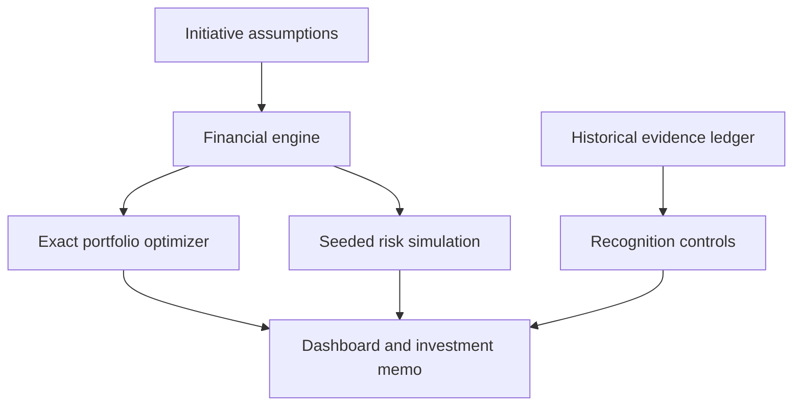

<div align="center">

# MarginOps
### Turn operational decisions into financial impact.

**An auditable EBITDA improvement engine, capital allocation optimizer, and value assurance workbench.**

[](https://github.com/kingtutt52/marginops/actions/workflows/ci.yml)


</div>


Most improvement programs have a list of ideas. What they need is a defensible answer to **“Which initiatives should we fund, how much EBITDA could they create, and how will we prove it?”**

MarginOps closes that loop. It translates operating levers into monthly financial forecasts, finds the best feasible investment portfolio, stresses the assumptions, and reconciles claimed benefits to a finance-reviewed evidence ledger.

> **Portfolio demonstration.** Every company, initiative, evidence reference and financial figure is synthetic. The results below are model outputs, not actual savings or employer achievements. No credentials or proprietary data are required.

## Run in 30 seconds

Requires Node.js 22 or newer. There are **no external runtime dependencies, API keys, build steps or package installs**.

```bash
git clone https://github.com/kingtutt52/marginops.git
cd marginops
npm start
```

Open **http://localhost:3000**. Run `npm test` for the financial and API tests, or `npm run report` for a reproducible JSON analysis. The server binds to loopback by default; `HOST` and `PORT` are configurable.

## What the demonstration produces

At the default $600,000 implementation budget and 24 team-month delivery capacity:

| Model output | Synthetic base case |
|---|---:|
| Expected incremental EBITDA, Year 1 | **$2,387,958** |
| Steady-state annualized impact | **$3,418,000** |
| Upfront implementation expense + capex | **$580,000** |
| First modeled cash recovery | **Month 5** |
| Selected initiatives | **7 of 10** |
| Portfolios evaluated | **1,024** |
| Simulated Year 1 EBITDA, P10 / P50 / P90 | **$1.38M / $2.41M / $3.33M** |

The optimum selects cloud right-sizing, supplier consolidation, license rationalization, pricing guardrails, scrap reduction, the data foundation, and predictive scheduling. The enabling data foundation has negative standalone value but unlocks a stronger combined business case.

These outputs are conditional on the provided benefit and success assumptions. P10/P50/P90 describe 2,000 seeded simulated outcomes, not confidence intervals estimated from empirical data. The illustrative $8M baseline exists only to demonstrate the EBITDA bridge; it does not drive optimization.

## Explore the product

1. **Portfolio overview** — adjust budget, delivery capacity, realization and rollout delay. Inspect an EBITDA bridge, monthly EBITDA versus cash, and simulation outcomes.
2. **Initiative workbench** — inspect economics and evidence requirements. Select a custom portfolio and see prerequisite, budget or overlap violations immediately.
3. **Benefits ledger** — distinguish observed change from attributable, finance-approved benefit. Pending and rejected claims receive no recognized credit.
4. **Model & methodology** — review formulas, accounting boundaries and limitations inside the application.
5. **Export investment memo** — download the current selection, financial case, uncertainty assumptions, evidence requirements and approval gates as Markdown.

## Engineering that serves the business case

- **One financial engine, two interfaces.** Pure ECMAScript modules execute in the browser, API and CLI, preventing frontend/backend formula drift.
- **Exact constrained selection.** Exhaustive subset optimization enforces budget, delivery capacity, prerequisite inclusion and mutually exclusive benefit pools. Empty selection is valid; negative projects are not forced into the portfolio.
- **Risk stays in the numbers.** Costs remain if initiatives fail. Expected forecasts weight benefits by probability; seeded simulation samples success events with a shared realization shock.
- **EBITDA is not cash.** Revenue uses contribution margin. Capex affects cash. Receivables acceleration produces a one-time cash release, not earnings.
- **Evidence before recognition.** The ledger rejects duplicate period/benefit-pool claims, preserves losses, and requires approval metadata for recognized benefits.
- **Simple deployment surface.** Node's built-in HTTP server, explicit static-file allowlist, bounded request bodies, restrictive content policy, no third-party runtime code.

There is **no LLM in the calculation path**. An AI integration can propose structured initiatives later; financial validation, optimization and approval should remain deterministic and inspectable.

## Architecture



```text
src/engine.mjs       Forecasting, optimization, simulation, ledger validation
src/server.mjs       Local HTTP server and JSON API
src/report.mjs       Reproducible CLI analysis
web/                Responsive dashboard, scenario controls and memo export
data/               Synthetic initiative assumptions and historical ledger
test/               Financial invariants, independent oracle and HTTP tests
docs/               Financial methodology, API contract and model overview
```

## API

```bash
curl -X POST http://localhost:3000/api/optimize \
  -H 'Content-Type: application/json' \
  -d '{"scenario":{"budget":600000,"capacity":24,"realization":1,"delay":0}}'
```

See [API contract](docs/API.md) for custom portfolio evaluation and error behavior. See [financial methodology](docs/METHODOLOGY.md) for equations, modeling choices and production boundaries.

## Verification

`npm test` covers capex treatment, contribution margin, working-capital classification, failure costs, rollout ramp, constraints, negative prerequisites, duplicate benefit claims, and simulation reproducibility. An independently expressed enumeration oracle verifies the synthetic portfolio optimum at multiple budgets. API checks cover malformed input, oversize bodies, route isolation and matching portfolio results.

GitHub Actions runs syntax checks and the test suite on Node 22 and 24. A repeatable optional browser smoke script is included in `scripts/browser-smoke.mjs`. Browser verification could not be executed in the build environment because Chromium was unavailable and its download failed. The UI therefore still needs a real-browser visual review.

## Production boundaries

This is a runnable decision-support prototype, **not a production finance system**. The demo ledger is read-only; scenario edits are session-only; exported memos preserve a snapshot. It has no authentication, persistence, approval enforcement, ERP integration or empirical causal estimation. It does not represent employer work or claim realized outcomes.

Before enterprise use: replace synthetic inputs with controlled data contracts; authenticate users and approvers; persist versioned assumptions and evidence in an append-only audit store; reconcile to finance-owned baselines; calibrate success and dependence assumptions; review service-level safeguards; and reconcile non-GAAP reporting with accounting policy. Detailed limitations are in [methodology](docs/METHODOLOGY.md).

## License

[MIT](LICENSE). Built as an independent portfolio project for [Austin Tuttle](https://github.com/kingtutt52).
